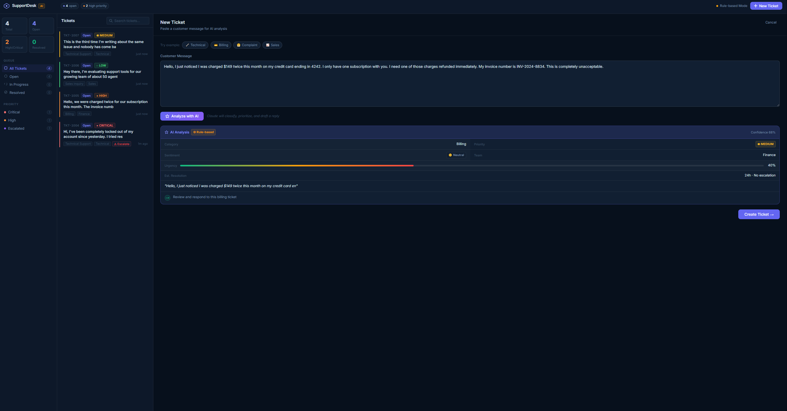
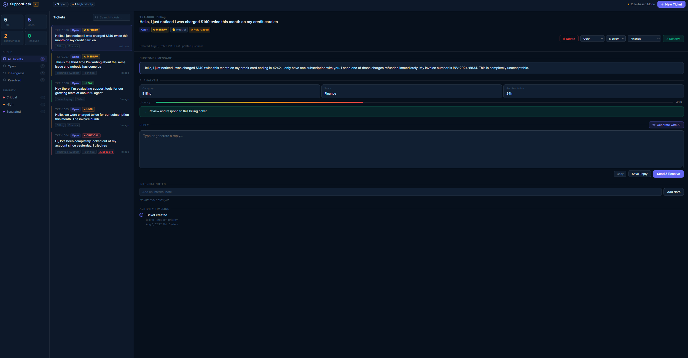

# SupportDesk – Ticket- & Support-System

Support-Tool, das eingehende Kundenanfragen automatisch einordnet und als Ticket
im System anlegt. Die Anwendung läuft im Browser und nutzt einen Node.js-Server
für Logik, API-Anbindung und die optionale KI-Analyse.



## Technologien

Node.js · JavaScript · REST · Anthropic API · HTML/CSS

## Idee

Statt Support-Anfragen manuell zu sortieren, übernimmt das System den ersten
Schritt: Anfrage analysieren, Kategorie erkennen, Priorität einschätzen und ein
passendes Team vorschlagen. Der Support-Workflow wird dadurch strukturiert
abgebildet, vom Eingang der Anfrage bis zum abgeschlossenen Ticket.

## Funktionen

- Eingabe von Kundenanfragen oder Nutzung vorbereiteter Beispieltexte
- Automatische Einordnung nach Kategorie, Stimmung und Dringlichkeit
- Urgency-Score in Prozent und Confidence-Wert zur Einordnung
- Priorisierung von Low bis Critical
- Vorschlag für das zuständige Team
- Automatische Kennzeichnung eskalationsbedürftiger Tickets
- Geschätzte Bearbeitungsdauer pro Ticket
- Verwaltung der Tickets mit den Status Open, In Progress und Resolved
- Such- und Filterfunktion über alle Tickets, Filter nach Status und Priorität
- Interne Notizen pro Ticket
- Timeline mit allen Änderungen am Ticket
- Dashboard mit Kennzahlen zum Ticketbestand
- Optionale KI-Analyse mit Antwortvorschlägen
- Regelbasierter Fallback-Modus, der ohne API-Key funktioniert



## Wie es funktioniert

Aus einer eingegebenen Nachricht wird ein Ticket erzeugt. Mit hinterlegtem
API-Key geht die Anfrage an die Anthropic API und wird strukturiert analysiert,
also Kategorie, Priorität und Stimmung. Ohne API-Key greift die Anwendung auf
Regeln und Keywords zurück.

Beide Wege führen zum selben Ergebnis: ein nutzbares Ticket im System. Der
Fallback ist bewusst so gebaut, dass die Anwendung nicht von einem externen
Dienst abhängt.

Der Rule-based-Modus arbeitet mit Keywords und erreicht dadurch eine geringere
Trefferquote bei impliziten Formulierungen. Die Confidence wird deshalb mit
ausgegeben, damit unsichere Einordnungen erkennbar bleiben.

## Installation

Voraussetzung ist Node.js ab Version 18.

```bash
npm install
node server.js
```

Anschließend im Browser öffnen: http://localhost:3000

Die Anwendung benötigt den Server. Ein direkter Aufruf von `index.html`
funktioniert nicht.

## Optional KI aktivieren

Erstelle eine `.env` Datei im Projektordner:

```
ANTHROPIC_API_KEY=dein_api_key
```

Ohne API Key läuft die Anwendung automatisch im Fallback Modus.

## Projektstruktur

- `index.html` → Aufbau der Oberfläche
- `style.css` → Design und Layout
- `app.js` → Frontend Logik
- `server.js` → Backend und API
- `package.json` → Abhängigkeiten

## Hinweis zur KI Nutzung

Bei der Entwicklung wurde Claude unterstützend genutzt, zum Beispiel für Ideen, Struktur und einzelne Implementierungen.

Die Auswahl, Anpassung, Integration und Funktionsprüfung der Logik wurden eigenständig durchgeführt.

## Hinweis

Die Anwendung läuft lokal auf deinem Rechner.
`index.html` alleine funktioniert nicht, da ein Server benötigt wird.

## Kurz gesagt

Das Projekt zeigt, wie ein einfaches Support System mit automatischer Ticket Einordnung aufgebaut sein kann, inklusive optionaler KI Integration.
